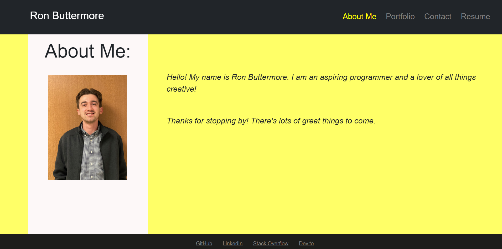

# React Portfolio

## Description
This application was created with React as a way to display my portfolio to interested parties. The user of this application can see a information about me, my projects, contact me, and view my proficiencies all from a single page.

## Usage
The application can be found deployed at https://github.com/ronbuttermore/react-portfolio.git. In order to switch between informational sections, the user may click on the links contained in the navbar at the top of the page. Users can find the links to the deployed applications and github repositories in the projects section of the application, and can contact me using the contact form page. A link to my resume can be found in the resume section of the application.

## License
MIT Open-Source License

Copyright (c) 2023 Ron Buttermore

Permission is hereby granted, free of charge, to any person obtaining a copy of this software and associated documentation files (the "Software"), to deal in the Software without restriction, including without limitation the rights to use, copy, modify, merge, publish, distribute, sublicense, and/or sell copies of the Software, and to permit persons to whom the Software is furnished to do so, subject to the following conditions:

The above copyright notice and this permission notice shall be included in all copies or substantial portions of the Software.

THE SOFTWARE IS PROVIDED "AS IS", WITHOUT WARRANTY OF ANY KIND, EXPRESS OR IMPLIED, INCLUDING BUT NOT LIMITED TO THE WARRANTIES OF MERCHANTABILITY, FITNESS FOR A PARTICULAR PURPOSE AND NONINFRINGEMENT. IN NO EVENT SHALL THE AUTHORS OR COPYRIGHT HOLDERS BE LIABLE FOR ANY CLAIM, DAMAGES OR OTHER LIABILITY, WHETHER IN AN ACTION OF CONTRACT, TORT OR OTHERWISE, ARISING FROM, OUT OF OR IN CONNECTION WITH THE SOFTWARE OR THE USE OR OTHER DEALINGS IN THE SOFTWARE.
